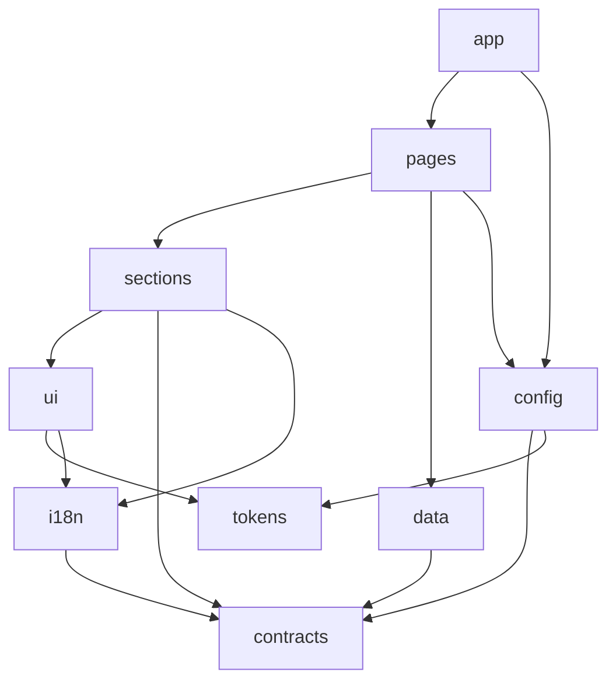

# Freeducation — Architecture

The foundation. Read this before writing a single line of code.

Everything here exists to serve one requirement:

> **Many schools. Same data shapes. Completely different designs. One codebase that
> never forks, and upgrades cleanly for everyone.**

---

## 1. The one rule everything else follows

**Design never touches data.**

A component that renders must not know where its content came from. A module that
fetches must not know how its content will look.

They meet in the middle at a **view-model** — a plain, typed object produced by a page
controller and consumed by a design variant. Both sides are written against that
contract, never against each other.

This is what makes the rest possible:

| Because design and data are separated | We get |
|---|---|
| Variants only receive a view-model | Any school can swap Home design v1 → v3 with a config value |
| Fetching lives in one layer | The backend can be replaced without touching 200 components |
| View-models are typed and fixture-backed | Every variant is testable without a network |
| No school-specific code in core | `git pull` upgrades every school at once |

If a change would require a component to fetch, or a fetcher to care about layout,
the change is wrong. Find another way.

---

## 2. The five foundations

Everything at the "basement" level is one of these five systems. Nothing else belongs
in the foundation.

### 2.1 Contracts — the law of shapes

One package defines every entity the product knows about: `Notice`, `Teacher`,
`Event`, `ClassRoutine`, `Result`, `GalleryAlbum`, `Page`, `MenuItem`, `School`.

Each is a **Zod schema** first, and its TypeScript type is inferred from it. That means
the same definition validates at runtime and checks at compile time — they cannot drift.

```ts
export const Notice = z.object({
  id: z.string(),
  title: LocalizedText,
  body: LocalizedText,
  category: z.enum(['academic', 'office', 'admission', 'general']),
  publishedAt: z.string().datetime(),
  attachments: z.array(Attachment).default([]),
  pinned: z.boolean().default(false),
})
export type Notice = z.infer<typeof Notice>
```

Contracts depend on nothing. Everything else depends on contracts.

### 2.2 Data — external content, addressed by key

Content comes from outside this repo. The frontend never knows which backend it is
talking to. It asks for a **key**:

```ts
const notices = await data.get('notice.list', { category: 'academic', page: 1 })
//    ^? Notice[]  — inferred from the key, validated at the boundary
```

The key union is closed and typed:

```ts
type DataKey =
  | 'school.profile'
  | 'notice.list'   | 'notice.bySlug'
  | 'teacher.list'  | 'teacher.byId'
  | 'event.list'    | 'event.bySlug'
  | 'routine.byClass'
  | 'result.lookup'
  | 'gallery.albums'| 'gallery.album'
  | 'page.bySlug'
```

Behind that sits a `DataSource` interface with swappable adapters:

- **`httpSource`** — the real external API, authenticated with a key from env
- **`fixtureSource`** — local JSON, used by tests, previews and offline development
- future: a CMS adapter, a cached edge adapter — added without touching any page

Every response is parsed through its contract schema at the boundary. Malformed data
fails loudly in development and degrades to a clean empty state in production. No
untyped `any` ever escapes this layer.

### 2.3 Config — what makes a school itself

One validated object describes a school completely:

```ts
{
  identity:  { name, shortName, eiin, established, logo, address, phones, emails },
  locales:   { supported: ['bn','en'], default: 'bn' },
  theme:     { preset: 'sapphire', overrides: { 'color.primary': '#0B6E4F' } },
  variants:  { home: 'hero-split', notice: 'table-dense', teacher: 'grid-photo' },
  features:  { hostel: false, transport: true, onlineAdmission: true, portal: false },
  menu:      [ { pageKey: 'notice', label: {...}, children: [...] } ],
}
```

Config is **data, not code**. A new school is a new config record — never a new folder
of components. If a school needs something config cannot express, that is a signal the
foundation is missing a feature, not a licence to fork.

Invalid config is a hard failure at boot. Silent fallbacks hide broken sites.

### 2.4 Theme — tokens, never raw values

Colour, spacing, radius, shadow, and type scale are declared once as **design tokens**
and emitted as CSS custom properties. Components reference `var(--color-primary)` and
nothing else.

A school picks a preset and may override individual tokens by name. Unknown token
names are rejected. Because components only ever read variables, a theme change is a
stylesheet swap — no re-render logic, no component edits, and dark mode is just
another token set.

**No component may contain a raw hex, rgb, or hard-coded pixel colour.** This is
enforced by lint, not by good intentions.

### 2.5 i18n — two kinds of text, both handled

Bangla and English are foundational, not a later feature. There are two distinct
problems and they need different solutions:

**Interface text** (button labels, headings, error messages) lives in typed catalogues:

```ts
t('notice.emptyState')   // key is type-checked; a missing key fails the build
```

**Content text** arrives from the API already multilingual:

```ts
type LocalizedText = { bn?: string; en?: string }
resolveText(notice.title, locale)   // handles fallback chain + missing translations
```

Reaching into `notice.title.en` directly is banned — it breaks the moment a school is
English-only or a translation is missing. Always go through `resolveText`.

**No user-facing string literal may appear in a component.** Enforced by lint.

---

## 3. Layers and the direction of dependency

Dependencies flow one way only. An arrow means "may import".



The two rules that matter most:

1. **`ui` and `sections` may never import `data`.** They are pure rendering. Break this
   and variants stop being swappable and testable.
2. **Nothing may import `app`.** The app is the outermost shell — routes, layouts,
   wiring. It is a consumer, never a dependency.

Sibling packages at the same level do not import each other.

---

## 4. Repository layout

A pnpm workspace monorepo. The split is not ceremony — it is what lets the dependency
rules above be *mechanically enforced* rather than merely documented.

```
freeducation/
├─ apps/
│  ├─ web/                     # the site shell: routes, layouts, middleware. Thin.
│  └─ gallery/                 # variant preview harness — every variant, every state
│
├─ packages/
│  ├─ contracts/               # Zod schemas + inferred types. Depends on nothing.
│  ├─ data/                    # DataKey union, DataSource, adapters, validation
│  ├─ config/                  # school config schema, resolution, feature flags
│  ├─ i18n/                    # catalogues, typed t(), resolveText, locale routing
│  ├─ tokens/                  # design tokens, theme presets, CSS var emission
│  ├─ ui/                      # primitives: Button, Card, Table, Modal, Pagination
│  ├─ sections/                # composed blocks with variants: NoticeList, TeacherGrid
│  ├─ pages/                   # page controllers + page-level design variants
│  └─ testing/                 # fixtures, the variant contract harness
│
├─ schools/                    # one config file per school. Data only. Zero logic.
│  ├─ _demo.json
│  └─ <school-slug>.json
│
├─ tools/
│  ├─ eslint-config/           # shared config + boundary rules
│  ├─ eslint-plugin-fe/        # custom rules: no-raw-color, no-bare-string, ...
│  └─ verify/                  # the structure verifier (see §7)
│
├─ docs/
│  ├─ ARCHITECTURE.md          # this file
│  └─ CONVENTIONS.md           # the enforceable rulebook
│
└─ .github/workflows/          # CI gates
```

`schools/` containing only JSON is deliberate and load-bearing. The moment a school
needs a `.tsx` file, upgradability is gone.

---

## 5. Anatomy of a page

Every page has the identical shape. No exceptions, no special cases.

```
packages/pages/notice/
├─ viewModel.ts              # data → NoticeViewModel. The ONLY place that fetches.
├─ viewModel.types.ts        # the contract between controller and variants
├─ variants/
│  ├─ table-dense/
│  │  ├─ index.tsx           # default export: (props: { vm: NoticeViewModel }) => JSX
│  │  └─ meta.ts             # id, display name, description, preview image, tags
│  ├─ card-stack/
│  │  ├─ index.tsx
│  │  └─ meta.ts
│  └─ board-classic/
│     ├─ index.tsx
│     └─ meta.ts
├─ index.ts                  # definePage({ key, viewModel, variants, defaultVariant })
└─ __tests__/contract.test.tsx
```

The flow at request time:

1. Route resolves the school from the hostname
2. Config says which variant this school uses for `notice`
3. `viewModel.ts` fetches via data keys and returns a typed `NoticeViewModel`
4. The registry hands back the chosen variant component
5. The variant renders the view-model. It fetches nothing, decides nothing.

Because step 5 is pure, a new design is a new folder. It touches no data code, no other
variant, and no other page. That is the whole point.

---

## 6. The variant system

### Variants are interchangeable or they are broken

Every variant of a page accepts **exactly** the same props: `{ vm: XViewModel }`. There
is no variant-specific prop, no variant-specific fetch, no variant-specific config
field. A school switching variants must never encounter a missing feature.

### Every variant handles every state

A view-model can be empty, partial, or huge. Each variant must render sensibly when:

- the list is empty (no notices yet)
- optional fields are missing (a teacher with no photo)
- content is long (a 40-word Bangla notice title)
- only one locale is present

This is verified automatically — see §7.

### Section variants too

The same pattern applies one level down. `NoticeList` has its own variants, and a page
variant composes section variants. A school can therefore mix: hero design A with a
notice board design C.

### Registration is explicit

Variants are registered in `index.ts`, not discovered by globbing. Magic discovery
breaks type inference and bundling. The structure verifier guarantees that every
variant folder on disk is registered, and every registered variant exists on disk — so
explicit registration never drifts out of date.

---

## 7. How the rules are obeyed, not merely followed

A convention nobody can violate is worth ten written in a wiki. Each rule below has a
mechanism that makes breaking it fail CI.

| Rule | Enforced by |
|---|---|
| Layer dependency direction | `eslint-plugin-boundaries` — an illegal import fails lint |
| `ui`/`sections` never fetch | Import ban on `packages/data` from those paths |
| No raw colours in components | Custom lint rule `fe/no-raw-color` |
| No hard-coded user-facing strings | Custom lint rule `fe/no-bare-string` |
| No direct `.en` / `.bn` access | Custom lint rule `fe/use-resolve-text` |
| No deep imports across packages | Package `exports` field + `import/no-internal-modules` |
| Every page folder is complete | `tools/verify` — asserts required files exist |
| Every variant is registered | `tools/verify` — cross-checks disk against registry |
| Every variant handles every state | Contract test renders all variants × all fixtures |
| All variants share one prop type | Type-level test in the contract harness |
| API payloads match contracts | Zod parse at the data boundary |
| School config is valid | Zod parse at boot; invalid config refuses to start |
| Menu points at real pages | `tools/verify` — every `pageKey` must exist in the registry |
| Bundle stays small | Size budget per route in CI |
| Accessibility does not regress | Automated a11y checks in the contract harness |

`pnpm verify` runs the whole set locally and is the same command CI runs. There is one
gate, and it is not optional.

### The contract harness

The single highest-value piece of tooling here. It walks the page registry and, for
every variant, renders it against every fixture state, then asserts: it does not throw,
it produces required landmarks, it has no accessibility violations, and its props type
matches the page's view-model type.

Adding a variant therefore cannot break another. Changing a view-model surfaces every
variant that needs updating, immediately, by name.

---

## 8. Upgradability

There are exactly **three legal ways** to customise a school:

1. **Config values** — identity, features, menu, locales
2. **Token overrides** — colours, type, spacing
3. **Variant selection** — which design each page uses

Anything else is a missing platform feature. The escape hatch, used rarely and
deliberately, is a school-specific variant package that may only *add* to the registry
— never patch core.

Consequences, which are the entire justification for the discipline above:

- Core improvements reach every school on upgrade
- No school can be stranded on an old version by local edits
- A design refresh ships as a new variant; nobody is forced to migrate
- Contract changes are versioned with changesets; breaking shape changes require a
  major bump and a written migration note

---

## 9. Stack

**Recommendation: TypeScript, Next.js App Router, pnpm workspaces, Turborepo, Zod,
Vitest, Playwright, ESLint with custom rules.**

Reasoning, briefly:

- Server components render school pages with almost no JavaScript shipped, which
  matters when the audience is on a mid-range Android over 3G
- Incremental revalidation fits notices exactly: cached until a webhook says otherwise
- One framework covers the public site now and the portal later, so the foundation is
  not thrown away at phase 2
- Deploys to Cloudflare Workers via OpenNext, keeping the hosting you already know

The honest alternative is **Astro**, which ships less JavaScript still and models the
variant idea just as cleanly. If the logged-in portal is dropped from the roadmap,
Astro is the better choice. I am recommending Next because the portal is on the roadmap.

Either way the architecture above is unchanged — that is deliberate. Contracts, data
keys, view-models, variants, tokens and the enforcement layer are framework-agnostic.
The framework is a rendering detail, and the foundation should survive replacing it.

---

## 10. Build order

The foundation comes first and is not skipped. Nothing about it is visible, and
everything depends on it.

| Step | Deliverable |
|---|---|
| 1 | Workspace, TypeScript config, lint, CI gate, `pnpm verify` skeleton |
| 2 | `contracts` — every entity schema |
| 3 | `tokens` + `i18n` — theming and bilingual text working end to end |
| 4 | `data` — DataSource interface, fixture adapter, HTTP adapter |
| 5 | `config` — school schema, resolution, feature flags, menu validation |
| 6 | `ui` primitives + the contract harness |
| 7 | First page end to end — **Notice**, with two variants, proving the whole model |
| 8 | Remaining pages, two variants each |
| 9 | `gallery` app — browse every variant in every state |

Step 7 is the real milestone. Notice is the page with the most states (empty, paginated,
attachments, bilingual, pinned) and it exercises every foundation layer at once. If the
architecture is wrong, Notice reveals it while the cost of changing course is still low.
