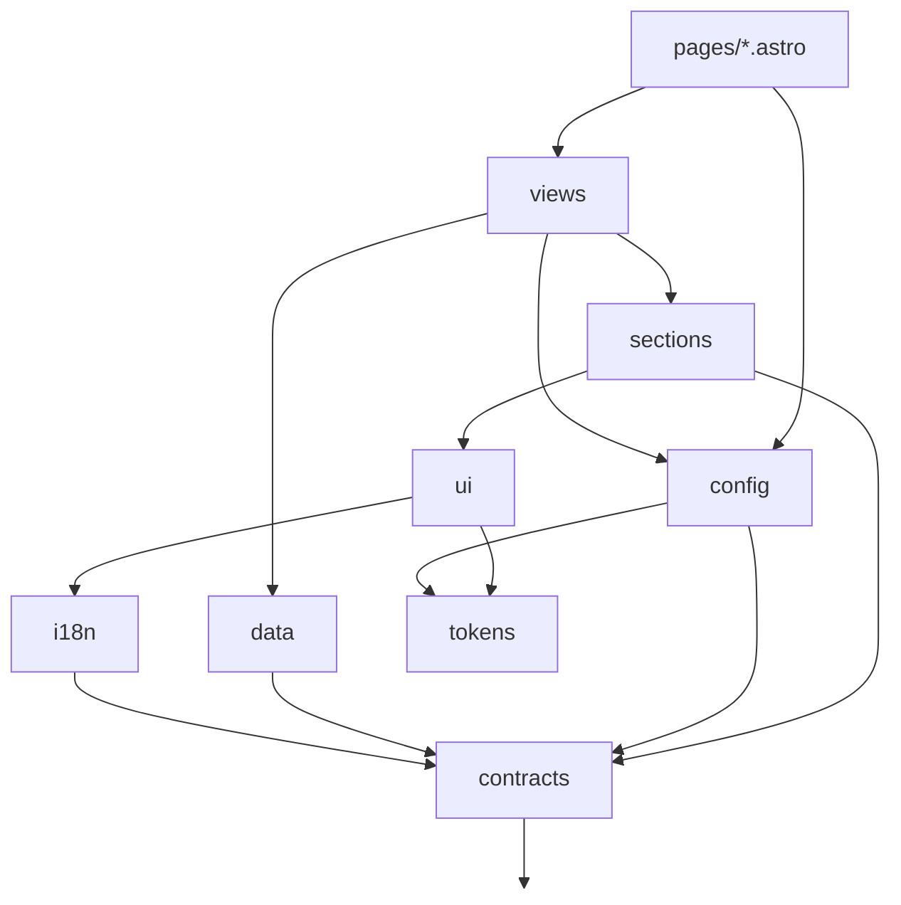

# Architecture

> **Design never touches data.**
>
> A component that renders must not know where its content came from. A module that
> fetches must not know how it will look. They meet at a typed **view-model**.

That one rule is why a school can have a completely different design without any code
being duplicated, and why the backend can change without touching a single component.

---

## How a request is served

There is **one route file** for the entire site: `src/pages/[...slug].astro`.

1. `loadSchool()` reads `schools/<slug>.json`
2. The data client fetches `site.navigation` — the menu tree
3. `buildRoutes()` flattens that tree into routes; `matchRoute()` finds the one for this URL
4. The route names a **view type** (`notice-list`, `rich-page`, …)
5. That view's `loadViewModel()` fetches everything the page needs
6. The chosen **variant** renders the view-model

The menu *is* the sitemap. A school adds a page by adding a menu item — no route file,
no deploy of new code. Detail pages fall out automatically: `notice/admission-2026`
resolves against the `notice` list route and becomes `notice-detail`.

---

## The five foundations

**`src/contracts`** — every entity as a Zod schema, with its TypeScript type inferred
from it. One definition validates at runtime and checks at compile time, so they cannot
drift. Depends on nothing.

**`src/data`** — content is fetched by key: `client.get('notice.list', { page: 1 })`.
The key union is closed, so the return type is inferred and a typo is a build error.
Adapters are swappable: `httpSource` talks to the real API with a key from env,
`fixtureSource` serves local sample content so the whole site builds and tests with no
backend. Every response is parsed through its contract at the boundary — nothing
unvalidated escapes this folder.

**`src/config`** — a school is a JSON file: identity, locales, theme, variant choices,
features. `schools/*.json` is auto-discovered, so adding a school is zero code. Invalid
config throws at boot; a half-configured site is worse than none.

**`src/tokens`** — colours, spacing and type as design tokens emitted as CSS custom
properties. Components read `var(--fe-*)` and nothing else, so restyling is a token
swap and dark mode is just another token set.

**`src/i18n`** — two problems, handled separately. Interface text comes from typed
catalogues (`t('notice.empty')`); a missing key fails verification. Content text arrives
multilingual from the API and goes through `resolveText(field, locale)` with a fallback
chain. Reading `.bn` or `.en` directly is banned by lint, because it breaks the moment a
translation is missing.

---

## Layers

Dependencies flow one way. `ui` and `sections` may **never** import `data` — that is
what keeps variants swappable and testable. Nothing may import `src/pages`.



Enforced by `import/no-restricted-paths` in `eslint.config.js`.

---

## Layout

```
src/
├─ contracts/     Zod schemas + inferred types. Leaf.
├─ data/          keys.ts (the DataKey union), source.ts, adapters/{http,fixture}
├─ config/        school schema + auto-discovering loader
├─ i18n/          catalogs/{en,bn}.json, resolveText, formatters
├─ tokens/        design tokens, theme presets, CSS var emission
├─ routing/       menu tree → routes, path matching
├─ ui/            primitives: Container, PageHeading, EmptyState, Prose, Pagination
├─ sections/      SiteHeader, SiteFooter — render the menu tree
├─ views/         page controllers + design variants  ← most work happens here
│                 controllers.ts (routing entry), registry.ts (full set, for tests)
├─ layouts/       Base.astro
├─ pages/         [...slug].astro and 404.astro. That is all.
└─ testing/       fixtures used by dev, previews and every test

schools/          one JSON per school. No logic, ever.
tools/verify/     the structure verifier
```

---

## Anatomy of a view

```
src/views/notice-list/
├─ viewModel.ts            the ONLY place that fetches
├─ index.ts                lazy variant registry + default
└─ variants/
   ├─ table-dense.astro    props: { vm, locale, t } — nothing else
   └─ card-stack.astro
```

Variants are registered as lazy loaders (`() => import('./variants/card-stack.astro')`)
so each is a separate build chunk and a page only executes the design it uses.

Adding a design is one new file plus one registry line. It touches no data code, no
other variant, and no other view.

Which variant renders is resolved from the school's `variants` map, falling back to the
view's default.

### Only the chosen design is shipped

Astro collects the styles of every component reachable from a route — including through
dynamic imports — so simply making variants lazy was not enough to stop unused CSS being
sent.

Two things keep a page down to the design it renders:

- `src/views/controllers.ts` imports each `viewModel.ts` **directly**, never through a
  view's `index.ts`, so no variant is reachable from the route that way.
- `virtual:fe/active-variants` is generated at build time by
  `tools/active-variants-plugin.mjs`. It reads the school's config and emits exactly one
  import per view: the design that school uses.

`src/views/registry.ts` still holds the full set, and is what the tests and the verifier
work against.

Verified: a school using `card-stack` receives no `table-dense` CSS.

---

## Enforcement

Conventions are only real if something checks them. `npm run verify` runs all of it, and
is the same command CI runs.

| Rule | Mechanism |
|---|---|
| Layer boundaries; variants never fetch | `import/no-restricted-paths` |
| No language-branch access on content | `no-restricted-syntax` → use `resolveText` |
| No `any`, no import cycles, 300-line files | ESLint |
| Every variant registered, and every registration exists | `tools/verify` |
| `defaultVariant` is a real variant | `tools/verify` |
| Every view is in the registry | `tools/verify` |
| Translations complete in every locale | `tools/verify` |
| School config points at real views and variants | `tools/verify` |
| `schools/` holds only JSON | `tools/verify` |
| Config rejects unknown tokens, presets, bad locales | Zod, tested |
| API payloads match contracts | Zod at the data boundary |
| No raw colours in a component | `fe/no-raw-color` |
| No hard-coded user-facing text | `fe/no-bare-string` |
| No per-school branching in code | `no-restricted-syntax` |
| No manual date formatting | `no-restricted-syntax` |
| No environment access in presentation code | `no-restricted-syntax` |
| **Every variant renders in every state** | the contract harness |

### The contract harness

`src/views/registry.test.ts` renders **every variant of every view against every fixture
state** — typical, empty, and single-locale — and asserts it produces non-blank output.

This is what makes variants genuinely interchangeable: a school switching design cannot
discover that the new one crashes on an empty notice list. Changing a view-model
immediately names every variant that needs updating.

---

## Stack

Astro 7 with TypeScript and Zod, server-rendered (`output: 'server'`), deployed to
Cloudflare Workers. Vitest for tests, ESLint for boundaries.

Astro was chosen over Next because this is a public content site with no logged-in
portal: it ships almost no JavaScript, which matters for a mid-range Android on 3G.

`ADAPTER=node` swaps in the Node adapter to preview a real production build locally.

### One build per school

`PUBLIC_SCHOOL` selects the school and is inlined at build time, so each school is its
own deployment on its own domain. This is simpler and cheaper than runtime multi-tenancy
and matches how these sites are actually hosted. Serving many schools from one
deployment would mean resolving the school from the `Host` header instead — the config
layer is ready for it, but nothing else assumes it.

---

## Forms

Reading content and sending something are both addressed by key. `src/data/forms.ts`
holds the closed set of things a visitor may submit, each with a Zod schema; the client
gains `submit(key, payload)` alongside `get(key, params)`, and both adapters implement
it — the HTTP source POSTs, the fixture source acknowledges with a reference so forms
work end to end with no backend.

Forms post back to their own page rather than to an endpoint, so a rejected form is
re-rendered with the visitor's answers still in place and each error beside the field
that caused it. **This works with JavaScript switched off.** Astro's origin check
rejects cross-site posts, and a honeypot field hidden from both people and screen
readers absorbs naive bots — anything that fills it is told the message was accepted
and nothing is sent onward.

Browser validation is treated as a convenience: every field is checked again on the
server before it reaches the backend.

## Cross-page links

A view never hardcodes another page's path. Controllers receive the whole route table
and resolve links through `findByView`, so a school that renames 'notice' to 'circulars'
keeps a working home page. Where several pages share a view — a notice list filtered to
admission notices is still a notice list — the plain, top-level one wins over a filtered
or nested one.

## Missing content

A detail view model sets `notFound` when its content does not exist, and the route
answers 404 while still rendering a real page with the site around it. Returning 200 with
an apology tells a crawler the page exists.

## Ornament

`decor` is school configuration: `none`, `alpona`, `kantha` or `terracotta`. Each is an
original vector drawn in a Bangladeshi idiom — rice-flour floor painting, nakshi kantha
running stitch, terracotta temple panels — a few hundred bytes, taking the school's own
colour, printed as a band under the header and above the footer at low contrast. Nothing
is traced or copied from elsewhere, so no school inherits a licensing problem.

## Time

A school keeps its own clock. `timezone` and `weekStartsOn` are school configuration,
defaulting to `Asia/Dhaka` and a Saturday-start week. Every date shown to a visitor, and
every decision about which calendar day an event falls on, is made in that zone — a
09:00 event in Dhaka appears on the Dhaka date even when the server runs in UTC. The
calendar grid is pure, timezone-aware and covered by its own tests.

## Videos

Videos are posters with a play button, not embeds. The provider is only contacted when
a visitor actually presses play, so no third party sees anyone who merely opens the
page, and nothing blocks the first render. With scripting off, the poster is simply a
link to the video. The backend supplies an embed URL and a poster, so the frontend never
has to know which provider is in use.

## Images

Content images arrive from the API as URLs, so they cannot be transformed at build time.
`src/ui/Photo.astro` is the single component every image goes through, and it does the
things that matter on a slow connection:

- **width and height are always set**, so the page does not jump as images arrive
- **lazy loading and async decoding** by default; pass `eager` for an image above the fold
- **`srcset` from `image.variants`** when the API supplies alternate sizes, so a phone
  downloads a phone-sized file
- **a graceful fallback** — an initial or an icon — when there is no image at all
- **`alt` through `resolveText`**, so it is translated, and empty for decorative images

The Cloudflare adapter is configured with `imageService: { build: 'compile', runtime:
'passthrough' }`: local assets are optimised at build time, and remote images are served
as they come. That avoids requiring the paid Cloudflare Images binding. If the content
API cannot produce sized variants, putting an image CDN in front of it is the next step.

## Deployment

Each school is a separate Cloudflare Worker named `freeducation-<slug>`, built with its
own `PUBLIC_SCHOOL` and therefore carrying only its own designs.

`.github/workflows/deploy.yml` builds and deploys on every push to `main`. It needs
`CLOUDFLARE_API_TOKEN` and `CLOUDFLARE_ACCOUNT_ID` as repository secrets, and skips with
a notice when they are absent rather than failing the build. `CONTENT_API_KEY` is pushed
to the Worker as a Worker secret.

## Constraints worth knowing

**One build per school.** `PUBLIC_SCHOOL` is inlined at build time, so each school is
its own deployment on its own domain. This is what allows the build to ship only that
school's designs. Serving many schools from one deployment would mean resolving the
school from the `Host` header and giving up per-school CSS trimming; the config layer
could do it, but nothing else assumes it.

**A design is chosen per view, not per menu item.** An earlier draft let an individual
menu item pick its own variant. That cannot coexist with shipping only the school's
chosen designs, because the menu is not known at build time, so it was removed.

## What is built, and what is next

Built: contracts, keyed data layer with two adapters, school config, tokens and theming
with dark mode, bilingual i18n, dynamic menu-driven routing, header with search box and
notice ticker, footer, 16 views with 22 variants, site search, class routine, result
lookup, a contact form and an online admission application, an events calendar, a video
gallery, an image pipeline, traditional ornament, the verifier, five project lint rules,
and 180 tests.

`httpSource` is exercised by integration tests against a real local HTTP server, covering
path and query construction, authentication headers, 404 handling, server errors and
timeouts. It has still never spoken to *your* backend — that is the one thing waiting on
you.

Next, in order:

1. Point `httpSource` at the real content API and check the payload shapes match
2. A variant gallery page for browsing every design in every state
3. Custom domains per school, once the first one is live
